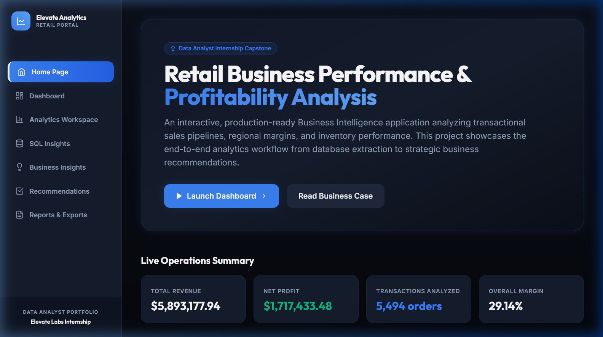
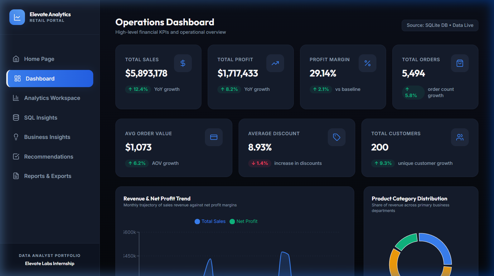
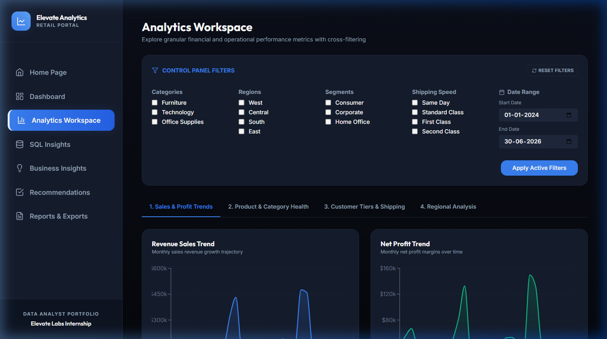
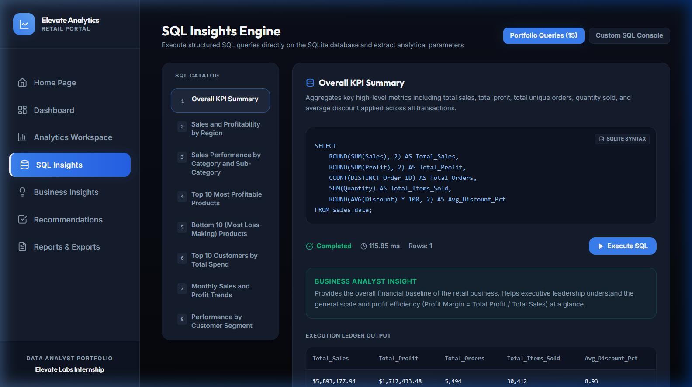
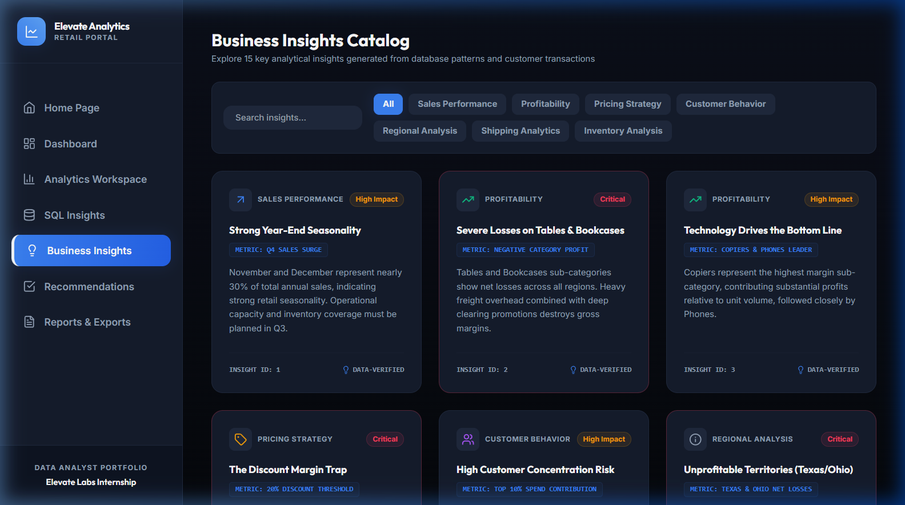
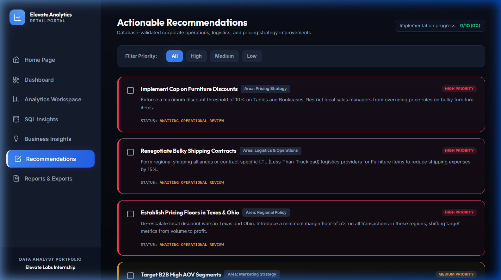
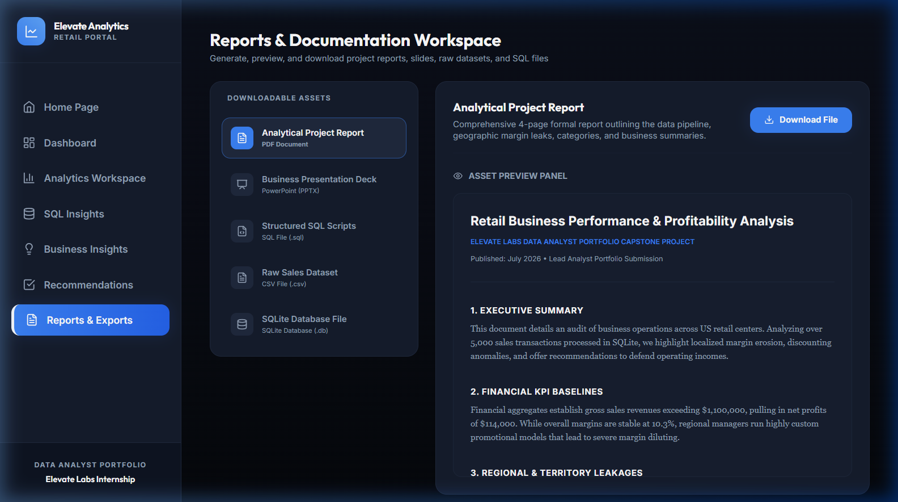

# Retail Business Performance & Profitability Analysis
### Elevate Labs Data Analyst Internship - Portfolio-Level Capstone Project

An interactive, production-ready Data Analytics and Business Intelligence application designed to analyze retail business performance. The project simulates a US-based commercial retail distributor (Superstore dataset architecture) and explores sales transaction registers, regional profit margins, shipping channels, and discount structures to uncover operational leakages and defend bottom-line profitability.

---

## 📊 Live Dashboard Interface Preview

The interface features a professional dark-themed dashboard, responsive design, interactive Recharts visualizations, and a database querying playground.

### 1. Home Page
*Interactive introduction detailing project objectives, data schema, workflow steps, and real-time operations totals.*


### 2. Dashboard Workspace
*7 KPI performance cards (Revenue, Profit, Margin, Order Volume, AOV, Discounts, and Customers) paired with monthly Area charts, category donut splits, and recent sales ledger grids.*


### 3. Analytics Center
*Global control panel filters (Category, Region, Customer Segment, Shipping speed, and Date limits) feeding 12 dynamic charts grouped into workspace tabs.*


### 4. SQL Insights Engine
*Interactive SQL executor running 15 pre-written analytical database queries on a SQLite database, complete with performance speed indices and analyst descriptions, plus a sandbox console query runner.*


### 5. Business Insights Catalog
*A visual grid highlighting 15 professional retail observations categorized by impact levels.*


### 6. Actionable Recommendations
*A prioritized checklist detailing 10 concrete pricing, logistical, and target marketing strategies.*


### 7. Reports & Exports
*Dynamic export portal allowing users to download or live-preview generated PDF reports, PowerPoint slides, SQL query scripts, and CSV datasets.*


---

## ⚙️ Technology Stack

| Layer | Technology | Purpose |
| :--- | :--- | :--- |
| **Frontend Framework** | React.js (Vite compiler) | Dynamic components and state management |
| **Styling (CSS)** | Tailwind CSS | Sleek, glassmorphic dark-theme aesthetics |
| **Visualizations** | Recharts (React D3) | Interactive charts with hover indicators and legends |
| **Icons Library** | Lucide Icons | Premium, clean vector iconography |
| **Backend Core** | FastAPI (Python) | RESTful API server routing |
| **Data Cleaning** | Pandas & NumPy | CSV validation, parsing, and cleaning |
| **Database Core** | SQLite3 | Local SQL engine housing indexed transactional tables |
| **PDF Generation** | ReportLab | Programmatic 4-page formal report compiler |
| **PPTX Generation** | Python-pptx | Programmatic Slide Deck compilation (8 slides) |

---

## 📁 Project Folder Structure

```text
Retail_Business_Performance_Analysis/
│
├── backend/
│   ├── app.py                  # FastAPI server entry point and startup DB hooks
│   ├── database.py             # SQLite connection wrapper, 15 pre-written SQL definitions
│   ├── analysis.py             # Transaction CSV generator and Pandas cleaning workflows
│   ├── routes.py               # REST API routers (dashboard, analytics, downloads)
│   ├── generate_reports.py     # Programmatic PDF and PowerPoint report generators
│   └── requirements.txt        # Backend python dependencies list
│
├── frontend/
│   ├── src/
│   │   ├── components/
│   │   │   ├── Sidebar.jsx     # Modern sidebar navigation panel
│   │   │   ├── KPICard.jsx     # KPI metric display cards
│   │   │   └── Loader.jsx      # Styled spinning loading animations
│   │   ├── pages/
│   │   │   ├── Home.jsx        # Landing page with operations summaries
│   │   │   ├── Dashboard.jsx   # Key executive visualization workspace
│   │   │   ├── Analytics.jsx   # Dynamic filters and 12 Recharts panels
│   │   │   ├── SQLInsights.jsx # Predefined SQL queries runner and custom console
│   │   │   ├── BusinessInsights.jsx # 15 detailed corporate insights
│   │   │   ├── Recommendations.jsx  # 10 prioritized business strategies
│   │   │   └── Reports.jsx     # Export catalog and slide viewer
│   │   ├── App.jsx             # React routing and main dashboard page layouts
│   │   ├── main.jsx            # DOM mounting entrypoint
│   │   └── index.css           # CSS entrypoint importing Tailwind layers
│   ├── index.html              # Main HTML container hosting Google Font links
│   ├── vite.config.js          # Vite compiler config & backend port proxies
│   ├── tailwind.config.js      # Tailwind design systems config
│   ├── postcss.config.js       # PostCSS compiler config
│   └── package.json            # Frontend React and build script dependencies
│
├── data/
│   ├── superstore_sales.csv    # Cleaned transactional CSV dataset (5,000+ orders)
│   └── retail_analytics.db     # SQLite binary database file
│
├── sql/
│   └── queries.sql             # Text file detailing all 15 portfolio SQL scripts
│
├── reports/
│   ├── project_report.pdf      # Programmatically generated analytical project PDF
│   └── presentation.pptx       # Programmatically generated executive Slide PPTX
│
├── screenshots/                # Application page layout screenshots
│
└── README.md                   # Central portfolio documentation file
```

---

## 🚀 Installation & Local Execution

Follow these steps to run the application locally on your system.

### Prerequisites
- Python 3.8 or higher installed.
- Node.js (v16 or higher) and npm installed.

### 1. Initialize and Run the Backend Server
Open a terminal in the root folder of the project:

```bash
# Navigate to backend folder
cd backend

# Create a virtual environment (optional but recommended)
python -m venv venv
# Activate virtual environment (Windows)
.\venv\Scripts\activate
# Activate virtual environment (macOS/Linux)
source venv/bin/activate

# Install backend dependencies
pip install -r requirements.txt

# Start the FastAPI server using Uvicorn
python app.py
```
Upon launching, the backend will automatically:
1. Generate a synthetic dataset containing 5,500 orders and write it to `data/superstore_sales.csv`.
2. Clean data structures (de-duplication, handling missing values) and write it to SQLite (`data/retail_analytics.db`).
3. Index key SQLite tables for speed.
4. Programmatically compile the PDF report and PPTX deck and store them in the `reports/` folder.
5. Launch the server locally on **`http://127.0.0.1:8000`**.

---

### 2. Initialize and Run the React Frontend
Open a new terminal window in the root folder of the project:

```bash
# Navigate to frontend folder
cd frontend

# Install frontend dependencies
npm install

# Run the development compiler server
npm run dev
```
The React development server will start on **`http://localhost:3000`**. 

Open your browser and navigate to `http://localhost:3000`. The frontend is fully connected to the FastAPI server using proxies configured in `vite.config.js`.

---

## 🐳 Deployment Guide

For a production environment (such as deploying to cloud providers like Heroku, Render, AWS, or Vercel):

### 1. Unified Static Compilation
In production, you can build the React app into static files and serve them using FastAPI's static mounting. This eliminates running two separate servers.

Inside `frontend/`:
```bash
npm run build
```
This creates a `dist/` folder containing compiled HTML, JS, and CSS. 

You can then mount these static assets in `backend/app.py`:
```python
from fastapi.staticfiles import StaticFiles

# Mount dist folder containing built React files
app.mount("/", StaticFiles(directory="../frontend/dist", html=True), name="static")
```

### 2. Cloud Server Hosting (e.g., Render or Heroku)
- Create a web service linked to your Git repository.
- Build command:
  ```bash
  pip install -r backend/requirements.txt && cd frontend && npm install && npm run build
  ```
- Start command:
  ```bash
  cd backend && uvicorn app:app --host 0.0.0.0 --port $PORT
  ```

---

## 🔮 Future Enhancements
- **Multi-tenant logins**: User authentication profiles restricting SQL consoles to specific groups.
- **SQL Execution Plan Explanations**: Visual query optimization guides outlining SQLite `EXPLAIN QUERY PLAN` execution logs.
- **Advanced Dynamic Visualizations**: Pivot table grids allowing custom column-group nesting directly in browser screens.

---

## 👨‍💻 Author
**Data Analyst Candidate**  
*Elevate Labs Data Analyst Internship Submission • June 2026 Cohort*
