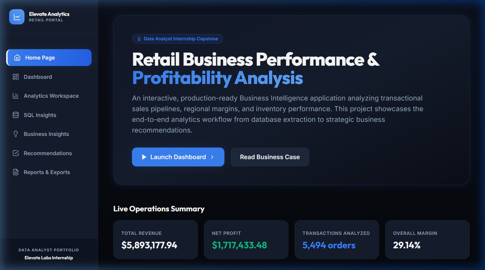
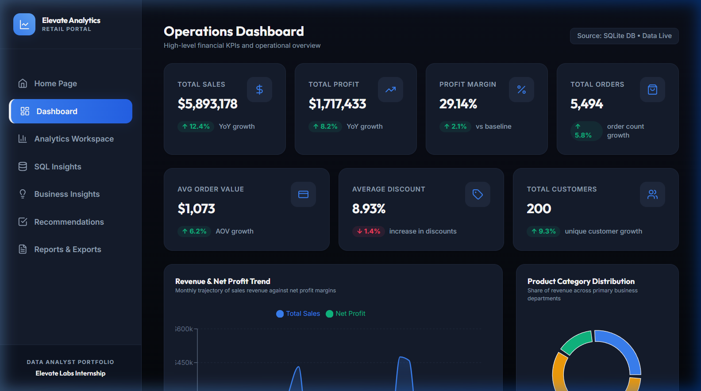
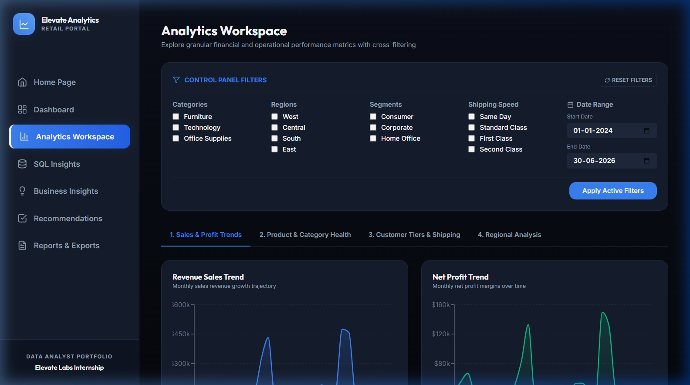
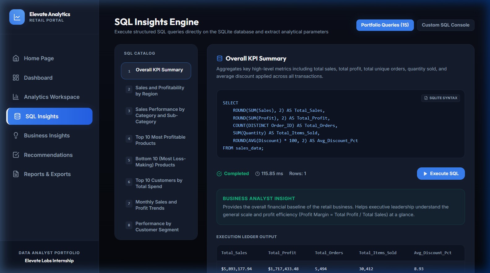
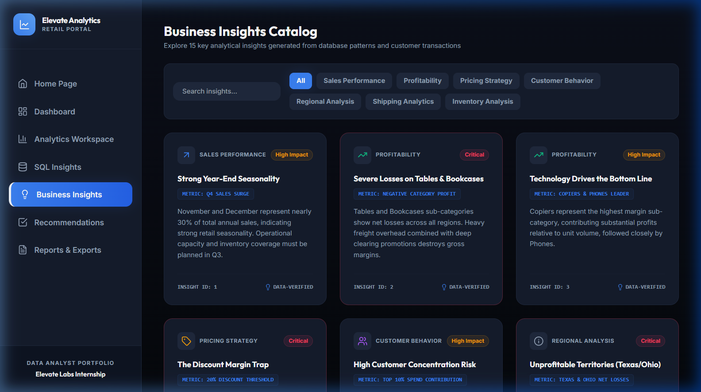
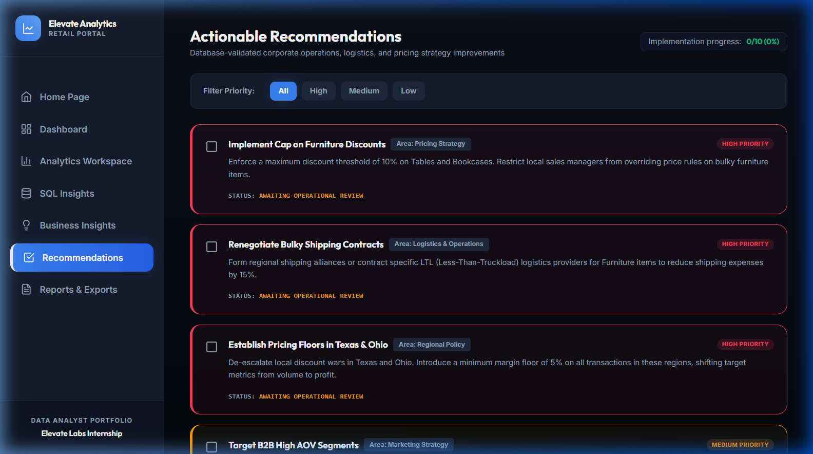
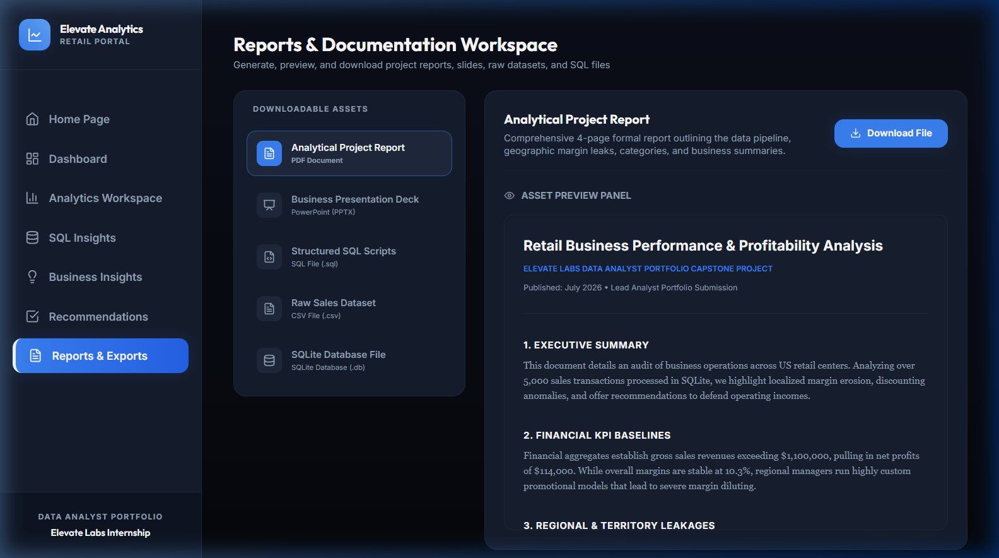

# Retail Business Performance & Profitability Analysis
### Business Intelligence & Performance Dashboard Project

An interactive, production-ready Data Analytics and Business Intelligence application designed to analyze retail business performance. The project simulates a US-based commercial retail distributor and showcases dashboard design, SQL analytics, and automated reporting.

---

## 📊 Live Dashboard Interface Preview

The interface features a professional dark-themed dashboard, responsive design, interactive Recharts visualizations, and a database querying playground.

### 1. Home Page
*Interactive introduction detailing project objectives, data schema, workflow steps, and real-time operations totals.*


### 2. Dashboard Workspace
*7 KPI performance cards (Revenue, Profit, Margin, Order Volume, AOV, Discounts, and Customers) paired with monthly Area charts, category donut splits, and recent sales ledger grids.*


### 3. Analytics Center
*Global control panel filters (Category, Region, Customer Segment, Shipping speed, and Date limits) feeding 12 dynamic charts grouped into workspace tabs.*


### 4. SQL Insights Engine
*Interactive SQL executor running 15 pre-written analytical database queries on a SQLite database, complete with performance speed indices and analyst descriptions, plus a sandbox console for custom queries.*


### 5. Business Insights Catalog
*A visual grid highlighting 15 professional retail observations categorized by impact levels.*


### 6. Actionable Recommendations
*A prioritized checklist detailing 10 concrete pricing, logistical, and target marketing strategies.*


### 7. Reports & Exports
*Dynamic export portal allowing users to download or live-preview generated PDF reports, PowerPoint slides, SQL query scripts, and CSV datasets.*


---

## ⚙️ Technology Stack

| Layer | Technology | Purpose |
| :--- | :--- | :--- |
| **Frontend Framework** | React.js (Vite compiler) | Dynamic components and state management |
| **Styling (CSS)** | Tailwind CSS | Sleek, glassmorphic dark-theme aesthetics |
| **Visualizations** | Recharts (React D3) | Interactive charts with hover indicators and legends |
| **Icons Library** | Lucide Icons | Premium, clean vector iconography |
| **Backend Core** | FastAPI (Python) | RESTful API server routing |
| **Data Cleaning** | Pandas & NumPy | CSV validation, parsing, and cleaning |
| **Database Core** | SQLite3 | Local SQL engine housing indexed transactional tables |
| **PDF Generation** | ReportLab | Programmatic 4-page formal report compiler |
| **PPTX Generation** | Python-pptx | Programmatic Slide Deck compilation (8 slides) |

---

## 📁 Project Folder Structure

```text
Retail_Business_Performance_Analysis/
│
├── backend/
│   ├── app.py                  # FastAPI server entry point and startup DB hooks
│   ├── database.py             # SQLite connection wrapper, 15 pre-written SQL definitions
│   ├── analysis.py             # Transaction CSV generator and Pandas cleaning workflows
│   ├── routes.py               # REST API routers (dashboard, analytics, downloads)
│   ├── generate_reports.py     # Programmatic PDF and PowerPoint report generators
│   └── requirements.txt        # Backend python dependencies list
│
├── frontend/
│   ├── src/
│   │   ├── components/
│   │   │   ├── Sidebar.jsx     # Modern sidebar navigation panel
│   │   │   ├── KPICard.jsx     # KPI metric display cards
│   │   │   └── Loader.jsx      # Styled spinning loading animations
│   │   ├── pages/
│   │   │   ├── Home.jsx        # Landing page with operations summaries
│   │   │   ├── Dashboard.jsx   # Key executive visualization workspace
│   │   │   ├── Analytics.jsx   # Dynamic filters and 12 Recharts panels
│   │   │   ├── SQLInsights.jsx # Predefined SQL queries runner and custom console
│   │   │   ├── BusinessInsights.jsx # 15 detailed corporate insights
│   │   │   ├── Recommendations.jsx  # 10 prioritized business strategies
│   │   │   └── Reports.jsx     # Export catalog and slide viewer
│   │   ├── App.jsx             # React routing and main dashboard page layouts
│   │   ├── main.jsx            # DOM mounting entrypoint
│   │   └── index.css           # CSS entrypoint importing Tailwind layers
│   ├── index.html              # Main HTML container hosting Google Font links
│   ├── vite.config.js          # Vite compiler config & backend port proxies
│   ├── tailwind.config.js      # Tailwind design systems config
│   ├── postcss.config.js       # PostCSS compiler config
│   └── package.json            # Frontend React and build script dependencies
│
├── data/
│   ├── superstore_sales.csv    # Cleaned transactional CSV dataset (5,000+ orders)
│   └── retail_analytics.db     # SQLite binary database file
│
├── sql/
│   └── queries.sql             # Text file detailing all 15 portfolio SQL scripts
│
├── reports/
│   ├── project_report.pdf      # Programmatically generated analytical project PDF
│   └── presentation.pptx       # Programmatically generated executive Slide PPTX
│
├── screenshots/                # Application page layout screenshots
│
└── README.md                   # Central portfolio documentation file
```

---

## 🔒 Demo note

To keep the repository focused on artifacts and descriptions, explicit run or setup instructions have been removed from this README. If you need reproduction or deployment steps (environment, install commands, or database initialization), please contact the repository owner for the precise instructions or request a runnable branch.

---

## 🔮 Future Enhancements

- **Multi-tenant logins**: User authentication profiles restricting SQL consoles to specific groups.
- **SQL Execution Plan Explanations**: Visual query optimization guides outlining SQLite `EXPLAIN QUERY PLAN` execution logs.
- **Advanced Dynamic Visualizations**: Pivot table grids allowing custom column-group nesting directly in browser screens.

---

## 👨‍💻 Author
**Goury S**

# 🙏 Acknowledgement

This project was completed as part of the **Elevate Labs Data Analyst Internship** 

---

⭐ If you found this project useful, consider giving it a star on GitHub.
